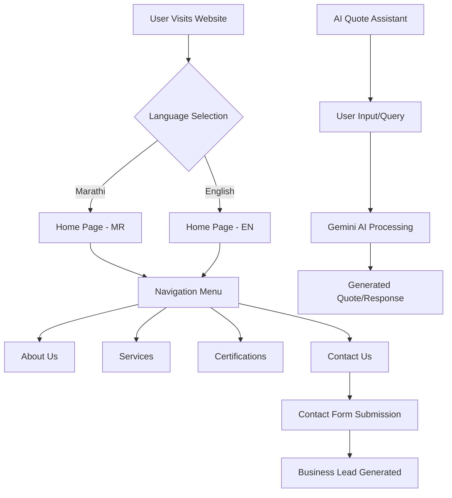

# Shree Jagannath Electricals & Infra Co.

A professional, multi-lingual (Marathi & English) business website for **Shree Jagannath Electricals & Infra Co.**, a registered government electrical contractor based in Bhadravati, Maharashtra. The company specializes in HT/LT line work, MSEDCL projects, and comprehensive electrical infrastructure solutions.

## 🚀 Features

- **Multi-lingual Support**: Seamlessly toggle between Marathi and English to cater to local and broader audiences.
- **AI Quote Assistant**: Integrated Gemini-powered assistant to help users get instant estimates and information about electrical services.
- **Responsive Design**: Fully optimized for mobile, tablet, and desktop viewing using Tailwind CSS.
- **Service Showcasing**: Detailed sections for HT/LT work, transformer installation, and industrial wiring.
- **Certification Tracking**: Displays government licenses and safety certifications.
- **Contact Integration**: Easy-to-use contact forms and location mapping.

## 🛠️ Tech Stack

- **Frontend**: React 19, TypeScript
- **Build Tool**: Vite
- **Styling**: Tailwind CSS
- **Icons**: Lucide React
- **Routing**: React Router Dom v7
- **AI Integration**: @google/genai (Gemini 3 Flash)
- **Deployment**: Optimized for modern cloud platforms (Netlify/Vercel/etc.)

## 📊 Application Flow



## 📂 Project Structure

```text
├── components/          # Reusable UI components (Layout, AI Assistant)
├── pages/               # Page components (Home, About, Services, etc.)
├── geminiService.ts     # Gemini API integration service
├── types.ts             # Global TypeScript definitions
├── constants.tsx        # Multi-lingual content strings and config
├── App.tsx              # Main application routing and state
└── index.tsx            # Application entry point
```

## ⚙️ Setup & Installation

1. **Clone the repository**
2. **Install dependencies**:
   ```bash
   npm install
   ```
3. **Set up Environment Variables**:
   Create a `.env` file in the root directory and add your Gemini API Key:
   ```env
   GEMINI_API_KEY=your_api_key_here
   ```
4. **Run development server**:
   ```bash
   npm run dev
   ```
5. **Build for production**:
   ```bash
   npm run build
   ```

## 📝 License

This project is developed for Shree Jagannath Electricals & Infra Co. All rights reserved.
